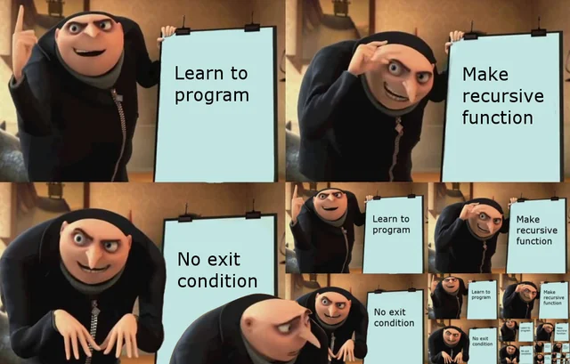

# Cấu trúc dữ liệu

<i>khái niệm con trỏ trong tài liệu này chỉ dùng để chỉ giá trị được trỏ đến trong mảng, không phải định nghĩa chính xác của con trỏ</i>

## pair

### khai báo
    pair<int,char> p;
### truy vấn
    p.first; gọi giá trị đầu tiên của pair

    p.seccond; gọi giá trị thứ 2 của pair 

## struct
### khai báo
    struct(
        int a;
        char b,c;
        string e,f,g;
        pair<int,int> amogus;
    ) tên;
### truy vấn

    tên.a;
    tên.b;
    tên.g;
    tên.amogus.first;

## mảng

### khai báo 
    int a[n];
    double a[n][m]; mảng 2 chiều 
    pair<int,int> a[n][m][l]; mảng 3 chiều

### Các hàm thông dụng
sort (sắp xếp) O(NlogN)
------

__sort(a+1,a+1+n);__

hoặc __sort(a,a+n);__ nếu mảng bắt đầu từ i=0

binary search (Tìm kiếm nhị phân) O(logN)
------
**Chỉ có thể sử dụng trên mảng đã sắp xếp**

__binary_search(a+1,a+1+n,val);__ Tìm giá trị val

__lower_bound(a+1,a+1+n, val);__ Tìm giá trị đầu tiên >=val

__upper_bound(a+1,a+1+n, val);__ Tìm giá trị đầu tiên >val

2 hàm trên sẽ trả về n+1 nếu không có giá trị nào trong mảng thỏa mãn

----

## vector

### khai báo

    vector<int> v; //vector 1 chiều 
    vector<vector<int>> v; //vector 2 chiều
    vector<vector<vector<int>> v; //vector 3 chiều
    vector<int> v(n); //tạo vector với n phần tử có sẵn(có thể đặt giá trị vào các vị trí)
    vector<int> v(n,0); //tạo vector với n phần tử có sẵn với giá trị 0.

### truy vấn

    v[i] //truy vấn tại vị trí i+1(index i)
    v.at(i) //truy vấn tại vị trí i-1 nhưng có thêm cảnh báo nếu 
    v.push_back(i); //chèn giá trị i vào cuối vector
    v.pop_back(i); //loại bỏ phần tử cuối của vector
    v.size(); //gọi kích thước của 
    v.empty(); //kiểm tra xem vector có rỗng không ->trả về true(có) hoặc false(không)
    

    truy vấn các phần tử trong vector:

    vòng for thông thường:
    for(int i=0;i<v.size();i++){
        cout<<v.at(i)<<' ';
    }

    vòng for với pointer(con trỏ):
    for(auto &i: v){
        cout<<i<<' ';
    }

### các hàm thông dụng
tương tự với mảng được triển khai bằng cú pháp:

__hàm(v.begin(),v.end(),val);__

#### ví dụ: 

sort(v.begin(),v.end());

lower_bound(v.begin(),v.end(),i);

## stack(LIFO)

vào trước ra sau

### khai báo

    stack<long long> stk;
    stack<pair<long long, double>> stk;

### truy vấn

    stk.top(); //lấy giá trị trên cùng của stack
    stk.push(); //chèn giá trị vào vị trí trên cùng của stack
    stk.pop(); //loại bỏ giá trị trên cùng của set
    stk.size(); //lấy độ dài của 
    stk.empty(); //kiểm tra stack có rỗng không tương tự như vector

## Queue (FIFO)
vào trước ra trước

### khai báo
    queue<int> q;
    queue<pair<int,string>> q;
    queue<vector<pair<double,string>>> q;

### truy vấn
    queue không thể truy vấn bằng index(vị trí)
    q.front(); //Lấy giá trị đầu tiên trong queue
    q.back(); //lấy giá trị cuối cùng trong q
    q.pop(); //loại bỏ giá trị đầ tiên trong q
    q.size(); //kích thước q
    q.empty(); //kiểm tra q có rỗng 

## deque (queue 2 đầu)

### khai báo
    deque<int> dq;
    ...

### truy vấn
    dq[i]; //gọi giá trị tại vị trí i+1(index i)
    dp.at(i) //gọi giá trị tại vị trí i+1
    dp.front(); //gọi giá trị đầu của dequeue
    dp.back(); //gọi giá trị cuối của dq
    dq.push_front(i); //chèn i vào đầu dq
    dq.push_back(i); //chèn i vào cuối dq
    dq.pop_front(); //loại bỏ phần tử đầu tiên của dq
    dq.pop_back(); //loại bỏ phần tử cuối cùng của 
    dq.size();
    dq.empty();

## set

mảng lưu trữ:
- giá trị độc nhất
- tự động sắp 

### khai báo
    set<string> st;
    set<int, greater<int>> st; //với set sắp sếp từ lớn -> bé 

### truy vấn
set không thể truy vấn bằng vị trí(index)

    st.insert(i); //chèn phần tử i vào set
    st.erase(i); //xóa phần tử i khỏi set
    st.clear(); //xóa toàn bộ phần tử của set
    st.size();
    st.empty();

    duyệt set:
    for(auto &i:set){
        cout<<i<<' ';
    }

## map
Map lưu trữ các giá trị bằng "khóa" thay vì vị trí.
Map sẽ tự động sắp sếp các khóa theo thứ tự tăng 

### khai báo
    map<int,int> mp;
    map<int,int,greater<int>> mp; //map sắp sếp theo chiều lớn -> 
    unordered_map<int,int> uo_mp; //map không sắp sếp(độ phức tạp khi truy xuất ít hơn)

### truy vấn
    mp[i]; //gọi giá trị của khóa 
    mp.at(i); //gọi giá trị của khóa i(không nên dùng)
    mp.insert({i,j}); //chèn khóa i có giá trị j vào map
    mp.erase(i); //xóa khóa i khỏi map
    mp.clear(); //xóa toàn bộ 
    mp.count(i); //kiểm tra khóa i có tồn tại trong map không
    mp.size();
    mp.empty();

    duyệt map:
    for(auto &i:mp){
        cout<<i.first<<' '<<i.second<<'\n';
    }

## Đồ thị/Cây 

### khai báo

    vector<vector<int>> adj; //khởi tạo mảng 2 chiều lưu trữ các nút con của nút tại vị trí i
    vector<vector<pair<int,int>>> adj; //đồ thị với trọng số cạnh
    vector<vector<int>> adj;
    vector<int> weight; //độ thị với trọng số điểm

### truy vấn
__nhập các cạnh {u,v}__

    //đồ thị vô hương
    adj[u].push_back(v);
    adj[v].push_back(u);
    //đồ thị có hướng
    adj[u].push_back(v);
    //đồ thị có trọng số đường đi w
    adj[u].push_back({v,w}) //hoặc {w,v} nếu muốn sắp sếp theo trọng số 
    //đồ thị có trọng số điểm w
    for(int i=0;i<n;i++){
        cin>>weight[i];
    }
    adj[u].push_back(v);

# Thuật toán(giải thuật)

## hàm lambda
đùng để thay đổi các hàm có sẵn
ví dụ:

    //dùng để sort vector pair theo phần tử thứ 2
    vector<pair<int,int>> a;
    sort(a.begin(),a.end()){
        return fst.second<sec.second;
    }

## đệ quy
Gọi hàm trong hàm 

    int recursion(int n){
        retrurn recursion(n);
    }

ví dụ thực tế:
FIBONACHI

    int fibo(int n){
        if(n==1) return 1;
        if(n==0) return 0;
        return fibo(n-1)+fibo(n-2);
    }

## Tham lam

cố gắng tìm cách tối ưu bằng cách duyệt qua tất cả các khả năng để tìm cách tối ưu nhất.

    Đặt N là số hoạt động và
    {I} là hoạt động thứ I  (1 <= I <= N)

    Với mỗi {I}, xét S[I] và F[I] lần lượt là thời gian bắt đầu và kết thúc của hoạt động đó.
    Sắp xếp lại các hoạt động theo thứ tự tăng dần của thời gian kết thúc.
    - Có nghĩa là, với I < J ta phải có F [I] <= F [J]

    //  A là tập hợp các hoạt động được chọn
    A = {1}
    //  J là hoạt động cuối cùng được chọn
    J = 1
    For I = 2  to N
    // ta có thể chọn I nếu nó là hoạt động cuối cùng
    // việc chọn lựa đã hoàn thành
    If S [I] >= F [J]
        // lựa chọn hoạt động 'I'
        A = A + {I}

        // hoạt động 'I' giờ trở thành hoạt động cuối cùng được lựa chọn
        J = I
    Endif
    Endfor

    Return A

Tham lam thường dễ nghĩ ra, dễ cài đặt và chạy nhanh, nhưng không phải lúc nào cũng đúng. Khi bạn sử dụng duyệt hoặc quy hoạch động, nó giống như bạn đang di chuyển trên mặt đất an toàn. Còn đối với tham lam, thì giống như bạn đang đi trên một bãi mìn.

Không tồn tại một công thức chung nào cho việc áp dụng Tham lam, tuy nhiên, ta có thể nhìn ra thuật tham bằng việc phân tích các tính chất của bài toán, kinh nghiệm cũng như trực giác.

__Một vài lưu ý nhỏ__

- Nhưng bài tập mà có vẻ cực kỳ phức tạp (như TCSocks) có thể xem như là dấu hiệu để tiếp cận bằng phương pháp Tham lam.

- Nhưng bài toán mà dữ liệu đầu vào rất lớn (mà kể cả thuật toán có độ phức tạp  vẫn không kịp) thường được giải bằng tham lam hơn là quay lui hoặc quy hoạch động.

- Mặc dù nó có vẻ rùng rợn, nhưng bạn nên nhìn thuật toán tham lam dưới đôi mắt của một thám tử chứ không phải là dưới cặp kính của một nhà toán học.

## Quy hoạch động(dynamic progframing)

về cơ bản thì là dùng kết quả của các bước trước để tính kết quả của bước hiện tại

ví dụ:

FIBONACI:

    int main()
    {
        long long n, f[100010];
        cin >> n;
        f[0] = 0;
        f[1] = 1;
        for (int i = 2; i <= n; i++)
            f[i] = f[i - 1] + f[i - 2];
        cout << f[n];
        return 0;
    }

Bước cầu thang

đếm cách để bước lên cầu thang thứ n khi bước lên 1-> k bậc

    int step(int n, int k){
        vector<int> dp(n+1,0);
        dp[0]=dp[1]=1;
        for(int i=2;i<=n;i++){
            for(int j=1;j<=k;j++){
                dp[i]+=dp[i-j];
                if(j==i) break;
            }
        }
        n dp[n];
    }

